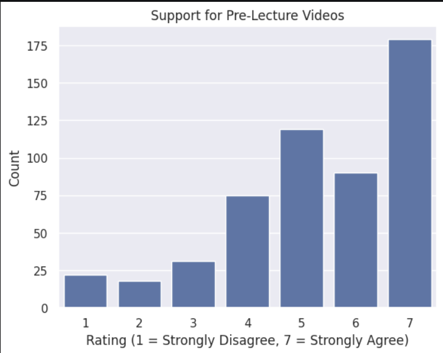
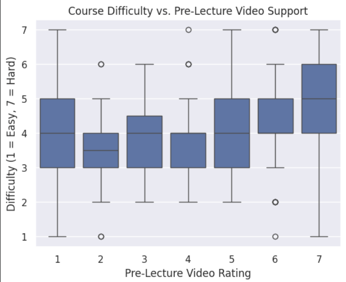
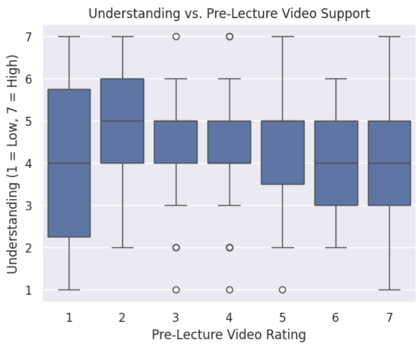

This analysis explores whether students who find COMP110 more difficult are more likely to support the use of pre-lecture videos.

## Data & Method
I used survey data from COMP110 students and analyzed the relationship between:
- Support for pre-lecture videos
- Course difficulty
- Student understanding

I used Python functions to clean and organize the data, and seaborn to create visualizations.

## Key Findings
- Many students rated pre-lecture videos as helpful
- Students who reported higher difficulty tended to support them more
- Students with lower understanding also tended to support them

## Visualizations

## Conclusion
The results suggest that pre-lecture videos could improve student learning, especially for students who find the course more difficult or have lower understanding. 

However, creating these videos would require additional time and effort from instructors, and not all students may use them consistently. 

In the future, more data could be collected on how students use pre-lecture videos and whether they lead to improved performance.
